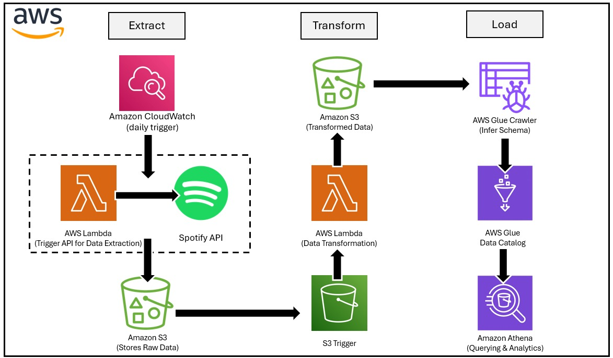

# Spotify-ETL-Pipeline-using-AWS
This project demonstrates an ETL pipeline built using Python and AWS services to extract top trending songs from the music industry for future analysis. The pipeline automates data extraction, transformation, and loading into an S3 data bucket, enabling further exploration and analytics.

## 📌 Problem Statement

The problem statement for this project is to create a data pipeline to find out the trending songs for each day and to find patterns in trending songs for aspiring music creators. Therefore, a pipeline is created to analyze and automate data collection for each day.

---

## ⚙️ How This Works

The first step in this process is to **extract the data** from the API where the playlist updates in a time frame. A JSON file is extracted which contains all the data and fields.

Next is the **transformation and loading phase**, where the JSON files are converted to CSV files. Only the required fields are filtered for daily analysis. The collection of these CSVs over time can be used for deeper data analysis.

---

## 🧠 Architecture Diagram

## 🧰 AWS Services Used

- **Amazon S3**:  
  Used to store both raw and transformed data. S3 triggers are used to invoke Lambda functions for the ETL operations.

- **AWS Lambda**:  
  Two separate Lambda functions are used:
  1. One for extracting the raw JSON data from the API.
  2. Another for transforming the JSON into a structured format (using Pandas) and converting it into CSV.

- **Amazon CloudWatch**:  
  Used to schedule daily triggers so that the database updates once per day automatically.

- **AWS Glue**:  
  A Glue Crawler is used to create a schema for the transformed CSV files. The generated tables are stored in the Glue Data Catalog.

- **Amazon Athena**:  
  Used for querying and analyzing the transformed CSV data directly from S3.
  A Glue Crawler is used to create a schema for the transformed CSV files. The generated tables are stored in the Glue Data Catalog.

- **Amazon Athena**:  
  Used for querying and analyzing the transformed CSV data directly from S3.

---
